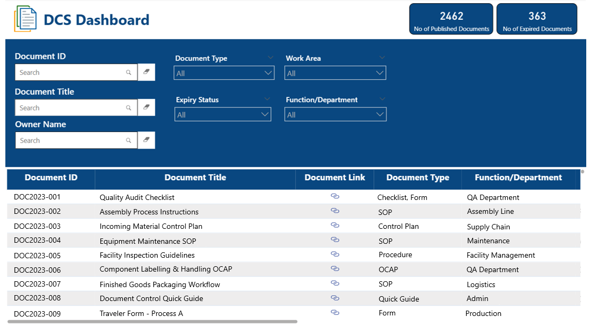
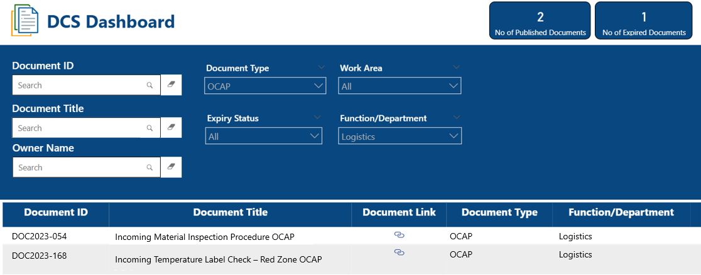
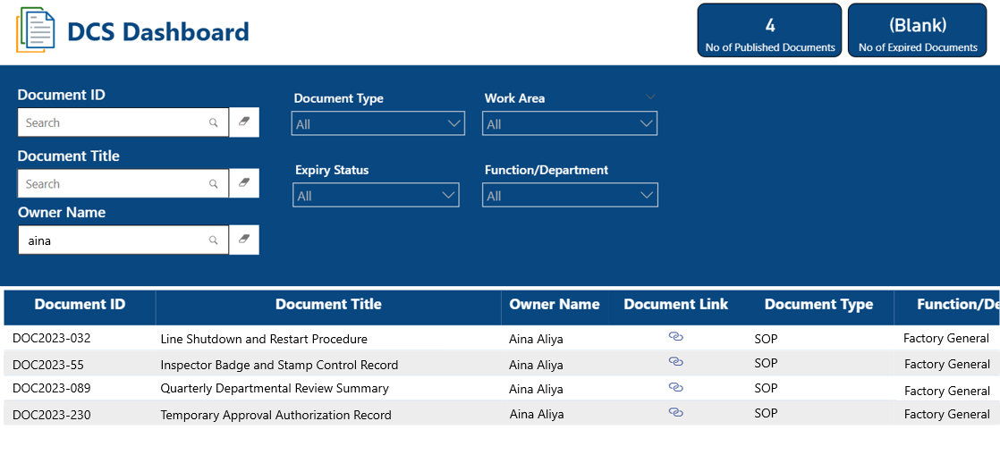

# 📋 Document Control System (DCS) Dashboard

## 📌 Overview
I created this dashboard to improve the **Document Control System (DCS)** — a platform that stores important documents like SOPs, control plans, and work guidelines used by different departments.

Before this, users had to download Excel files or go through many pages just to find a document. This project aimed to make that process faster and easier using **Power BI**.

Using **Power BI**, I imported document data like Document ID, Title, Type, Function, Owner, Work Area, and Status **directly from the Oracle database**. The result was an **interactive dashboard** that let users filter, search, and download documents easily from one place.

---

## 🔐 Confidentiality Note
*All data in this dashboard has been **recreated or anonymized to protect company confidentiality.** This sample only reflects the data logic and structure used in the actual project.*

---

## 🎯 Problem Statement  
Previously, users had to navigate through multiple pages or download Excel files to search and filter documents in the Document Control System (DCS). This process was time-consuming, inconvenient, and not user-friendly.

The goal of this project was to improve the DCS by creating a **single-page Power BI dashboard** where users could easily **search and filter documents** in real-time. This enhancement simplified document access, reduced manual effort, and made the system more efficient and accessible.

---

## ✅ Solution
The **DCS Dashboard** helped solve these problems by:
- 🔗 **Connecting directly** to the Oracle database for the latest data
- 📑 Allowing users to **filter and search** documents in real-time
- 📥 Adding **download links** for easy file access
- 📊 Showing document stats (e.g., published vs expired), enabling users to track which documents may need updates

---

## 🛠 Tools & Technologies

| Tool | Purpose |
|------|---------|
| **Power BI** | Building and designing the dashboard |
| **Oracle DB (Direct Import)** | Bringing in document data |
| **Power Query** | Cleaning and shaping the data |
| **Hyperlink Integration** | Letting users download files easily |

---

## 🧭 Project Walkthrough

### 🔍 Step 1: Dashboard Preview
This is the main interface that allows users to view, filter, and search documents. Summary tiles show the number of published and expired documents.

  

*Main Power BI dashboard with filters and table.*

---

### 🧠 Step 2: Table Relationships
Relationships between tables were created in Power BI to ensure correct filtering across all document attributes.

  

*Image recreated and blurred for confidentiality. It illustrates the relationships between tables in the data model.*

---

### ✅ Step 3: Scenario – Search by Document Attributes
This shows how a user can filter and search for a document by entering part of the title, selecting department, document type, or other fields.

  

*Example of using search and filters to find a document quickly.*

---

### 📥 Step 4: Scenario – Search by Document Owner
This scenario shows how a user can filter documents by owner name to locate all files maintained by a specific individual.

  

*Example showing documents searched by owner name.*

---

## 🔍 Key Features
- 🔎 Filter documents by department, work area, or ID
- 📥 Click to download any document instantly
- 📊 Summary cards for published vs expired documents (to help track outdated documents for updates)
- 🔄 Data is kept up to date from the Oracle system

---

## 📈 Impact
- Cut down search time from minutes to seconds
- No need to export or manually filter Excel files
- Easier document access across teams
- Enabled quick identification of expired documents, so teams know which files need to be reviewed or updated
  
---

## 🙋‍♀️ About Me
I’m a Computer Science graduate who enjoys solving problems through **data analytics and automation**. I use tools like Power BI, SQL, and Python to turn raw data into useful solutions.

[🔗 LinkedIn](https://www.linkedin.com/in/ainamardhiah2107/) 

